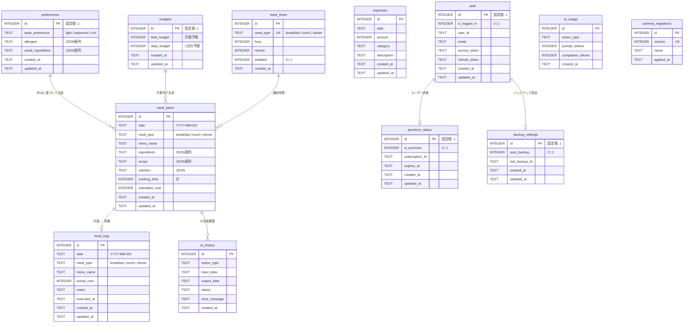

# BudgetBites - AI献立作成アプリ

[](https://apps.apple.com/jp/app/ai%E7%8C%AE%E7%AB%8B%E4%BD%9C%E6%88%90%E3%82%A2%E3%83%97%E3%83%AAbudgetbiters/id6756218102)
[](https://reactnative.dev/)
[](https://expo.dev/)

## 背景

「今日の献立、何にしよう...」

毎日の食事を考えることは、多くの人にとって負担になっています。栄養バランス、予算、好み、アレルギーなど、考慮すべき要素が多く、特に忙しい現代人にとって献立を考える時間は貴重です。

**BudgetBites**は、この課題を解決するために生まれました。Google Gemini AIの力を借りて、あなたの予算と好みに合った1ヶ月分の献立を瞬時に作成します。

## 主な機能

### AI献立自動生成
Google Gemini AIが、設定した月間予算と味の好みに基づいて、**1ヶ月分（朝・昼・晩）** の献立を自動生成します。

### カレンダー管理
生成された献立はカレンダー形式で表示。気分や予定に合わせて自由に編集・入れ替えが可能です。

### 細かなカスタマイズ
- **味付けの好み**: あっさり / バランス / こってり
- **アレルギー設定**: 卵、乳製品、小麦など
- **避けたい食材**: 苦手な食材を登録

### 献立通知
設定した時間に今日の献立を通知。朝・昼・晩それぞれの時間をカスタマイズできます。

### オフライン対応
ローカルSQLiteデータベースを使用し、インターネット接続がなくても献立の確認・編集が可能です。

## 技術スタック

| カテゴリ | 技術 |
|:---|:---|
| フレームワーク | React Native 0.81, Expo 54 |
| 言語 | TypeScript 5.9 |
| ルーティング | Expo Router 6 |
| データベース | SQLite (expo-sqlite) |
| 認証 | Supabase Auth |
| AI | Google Gemini API (gemini-2.5-flash) |
| 決済 | Stripe |
| 通知 | Expo Notifications |
| バックグラウンド処理 | react-native-background-fetch |

## アーキテクチャ

```
┌─────────────────────────────────────────────────────────────────┐
│                        Presentation Layer                        │
│  ┌─────────────┐  ┌─────────────┐  ┌─────────────┐              │
│  │   Screens   │  │ Components  │  │   Hooks     │              │
│  │  (app/*.tsx)│  │  (共通UI)   │  │ (カスタム)  │              │
│  └──────┬──────┘  └──────┬──────┘  └──────┬──────┘              │
└─────────┼────────────────┼────────────────┼─────────────────────┘
          │                │                │
          ▼                ▼                ▼
┌─────────────────────────────────────────────────────────────────┐
│                        State Management                          │
│  ┌─────────────────┐  ┌─────────────────┐  ┌─────────────────┐  │
│  │   AuthContext   │  │ TrackingContext │  │NotificationCtx  │  │
│  │   (認証状態)    │  │   (広告同意)    │  │  (通知権限)     │  │
│  └────────┬────────┘  └────────┬────────┘  └────────┬────────┘  │
└───────────┼────────────────────┼────────────────────┼───────────┘
            │                    │                    │
            ▼                    ▼                    ▼
┌─────────────────────────────────────────────────────────────────┐
│                        Service Layer                             │
│  ┌────────────────────────────────────────────────────────────┐ │
│  │                    ServiceFactory                          │ │
│  │  ┌─────────────┐ ┌─────────────┐ ┌─────────────┐          │ │
│  │  │MealPlanSvc  │ │ BudgetSvc   │ │NotificationSvc│         │ │
│  │  ├─────────────┤ ├─────────────┤ ├─────────────┤          │ │
│  │  │  AuthSvc    │ │ PremiumSvc  │ │SettingSvc   │          │ │
│  │  ├─────────────┤ ├─────────────┤ ├─────────────┤          │ │
│  │  │MealTimeSvc  │ │BackgroundSvc│ │             │          │ │
│  │  └─────────────┘ └─────────────┘ └─────────────┘          │ │
│  └────────────────────────────────────────────────────────────┘ │
└────────────────────────────────┬────────────────────────────────┘
                                 │
                                 ▼
┌─────────────────────────────────────────────────────────────────┐
│                       Repository Layer                           │
│  ┌─────────────┐ ┌─────────────┐ ┌─────────────┐ ┌───────────┐ │
│  │MealPlanRepo │ │ BudgetRepo  │ │PreferencesRepo│ │ AuthRepo │ │
│  ├─────────────┤ ├─────────────┤ ├─────────────┤ ├───────────┤ │
│  │MealLogRepo  │ │ExpenseRepo  │ │MealTimeRepo │ │PremiumRepo│ │
│  └─────────────┘ └─────────────┘ └─────────────┘ └───────────┘ │
└────────────────────────────────┬────────────────────────────────┘
                                 │
                                 ▼
┌─────────────────────────────────────────────────────────────────┐
│                        Data Layer                                │
│  ┌────────────────────────────────────────────────────────────┐ │
│  │              DatabaseConnection (Singleton)                 │ │
│  │  ┌─────────────────────┐    ┌─────────────────────┐        │ │
│  │  │   SQLite (Local)    │    │  Migration Manager  │        │ │
│  │  └─────────────────────┘    └─────────────────────┘        │ │
│  └────────────────────────────────────────────────────────────┘ │
└─────────────────────────────────────────────────────────────────┘

┌─────────────────────────────────────────────────────────────────┐
│                      External Services                           │
│  ┌─────────────┐  ┌─────────────┐  ┌─────────────┐              │
│  │   Supabase  │  │Google Gemini│  │   Stripe    │              │
│  │   (認証)    │  │   (AI)      │  │   (決済)    │              │
│  └─────────────┘  └─────────────┘  └─────────────┘              │
└─────────────────────────────────────────────────────────────────┘
```

### 設計パターン

- **Repository Pattern**: データアクセスの抽象化
- **Singleton Pattern**: DatabaseConnection, ServiceFactory
- **Factory Pattern**: サービスインスタンスの生成管理
- **Context API**: グローバル状態管理

## ER図



## ディレクトリ構成

```
app/
├── budget_bites-app/
│   ├── app/                    # 画面コンポーネント (Expo Router)
│   │   ├── _layout.tsx         # ルートレイアウト
│   │   ├── index.tsx           # ホーム画面
│   │   ├── mealPlanGenerate.tsx # 献立生成画面
│   │   ├── mealDetail.tsx      # 献立詳細画面
│   │   ├── mealTime.tsx        # 通知時間設定
│   │   ├── budgetEdit.tsx      # 予算編集
│   │   ├── preferenceSetUp.tsx # 好み設定
│   │   └── login.tsx           # ログイン画面
│   ├── components/             # 共通コンポーネント
│   ├── contexts/               # React Context
│   ├── hooks/                  # カスタムフック
│   ├── libs/                   # 外部ライブラリ連携
│   ├── repositories/           # データアクセス層
│   ├── services/               # ビジネスロジック層
│   ├── types/                  # TypeScript型定義
│   └── utils/                  # ユーティリティ関数
├── package.json
└── app.json
```

## セットアップ

### 前提条件

- Node.js 20以上
- npm または yarn
- Expo CLI
- iOS Simulator または実機

### インストール

```bash
# リポジトリのクローン
git clone https://github.com/your-username/BudgetBites.git
cd BudgetBites/app/budget_bites-app

# 依存関係のインストール
npm install

# 環境変数の設定
cp .env.example .env
# .envファイルを編集して必要なAPIキーを設定
```

### 環境変数

```env
EXPO_PUBLIC_SUPABASE_URL=your_supabase_url
EXPO_PUBLIC_SUPABASE_ANON_KEY=your_supabase_anon_key
EXPO_PUBLIC_GEMINI_API_KEY=your_gemini_api_key
EXPO_PUBLIC_STRIPE_PUBLISHABLE_KEY=your_stripe_key
```

### 起動

#### 開発ビルドの作成（初回のみ）

```bash
# iOS シミュレーター用の開発ビルドを作成
npx eas-cli build --profile development-simulator --platform ios
```

#### シミュレーターへのインストールと起動

```bash
# ビルドをダウンロードしてシミュレーターにインストール
npx eas-cli build:run --platform ios

# ネイティブビルドを実行 
npx expo run:ios 
```

シミュレーターでアプリを開くと、開発サーバーに自動接続されます。

## ライセンス

このプロジェクトはプライベートリポジトリです。

## 開発者

- keito isobe

---

Made with React Native + Expo
